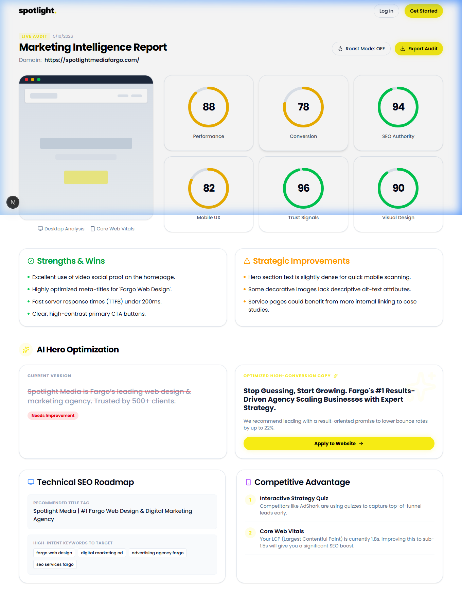

# Spotlight AI Auditor

Spotlight AI Auditor is a professional marketing intelligence platform designed to provide businesses with detailed website audits. It analyzes core web vitals, conversion optimization, and SEO authority to deliver actionable insights that scale revenue.

## Project Overview

This platform serves as a powerful tool for marketing agencies and business owners to evaluate the effectiveness of their online presence. By inputting a URL, the application performs a deep scan of the digital landscape to identify strengths and strategic improvements.

## Visual Showcase

### Primary Landing Page

The landing page features a premium design that adheres to the Spotlight Media brand identity. It uses a high contrast color palette of yellow and black to ensure professional readability and brand consistency.

### Interactive Audit Dashboard

The dashboard provides a comprehensive breakdown of website performance metrics. It includes specialized scoring for trust signals, mobile experience, and design quality.

## Core Capabilities

*   Real time website scanning and analysis
*   Comprehensive scoring for performance and trust
*   Expert level marketing recommendations
*   Custom hero copy optimization
*   Competitive landscape insights
*   PDF audit export functionality

## Technology Stack

The application is built using modern web technologies to ensure speed, security, and scalability.

*   Next.js 15 with App Router
*   Tailwind CSS 4 for utility first styling
*   Framer Motion for smooth interface transitions
*   Lucide React for professional iconography
*   Spotlight Media brand identity integration

## Getting Started

To run this project locally, follow these instructions.

1. Clone the repository from GitHub
2. Navigate to the project directory
3. Install dependencies using the npm install command
4. Start the development server using npm run dev
5. Open your browser to the local host address provided

## Branding Standards

The project follows strict branding guidelines to maintain a premium feel.

*   Primary Yellow: #f6eb14
*   Primary Black: #000000
*   Typography: Poppins for clean and geometric aesthetics

## Conclusion

Spotlight AI Auditor is built to transform how businesses view their digital marketing efforts. By providing clear and accurate data, it removes the guesswork from website optimization and helps industry leaders grow their presence.
